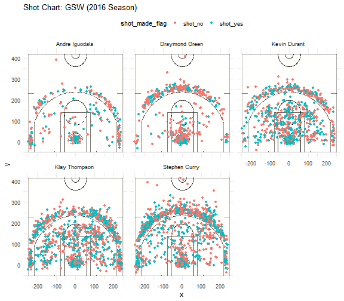
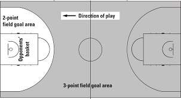

report
================
Hika Masuda

Report of Golden State Warriors Players in the 2016 Season
==========================================================

In recent years, it seems that the popularity of the Golden State Warriors has been gradually plummeting since they cannot seem to win as many games as they had been in the past. It seems like so many things are in their favor, as they have star players such as Stephen Curry and Kevin Durant, but they just are not doing as well as they were? What could be causing this decline in ability of the Golden State Warriors? Let's find out through a comparison of the top players in the 2016 season, when they won the NBA Championships, and the 2018 season.

### Motivation

Even as a person who knows absolutely nothing about basketball and has almost no interest in the sport itself, I had heard of the Golden State Warriors and many of their more famous players. A couple of years ago, I had heard so many good things about them, with my friends being excited to go watch their games. However, in recent years I only hear mediocre things about them, and that excitement has faded. So, it's only natural to wonder why this happened. By closely examining the statistics of the top players in the 2016 season when they won their last championship, it might help us get a step closer to finding the cause of the downfall of this team.

### Background

In the 2016-2017 season, the Golden State Warriors were one of the top teams in the basketball industry, winning their fifth NBA Championship. They even set the best postseason record in NBA history by winning all of their games but one. The top players of the season were Stephen Curry, Klay Thompson, Draymond Green, and Kevin Durant. Together, they were called the "Fantastic Four" and seemed to win the hearts of many fans. However, recently their record has been tarnished by multiple losses, and critics have started talking. According to Brad Botkin form CBS Sports, apparently the team has problem making 3 pointers, which they used to be known for.

Stephen Curry pictured above

### Data

The following is the percentages of shots made for the Fantastic Four and Andre Iguodala in the 2016 and 2018 seasons.

#### 2PT Effective Shooting % by Player (2016)

| name           |  total|  made|  perc\_made|
|:---------------|------:|-----:|-----------:|
| Andre Iguodala |    210|   134|   0.6380952|
| Kevin Durant   |    643|   390|   0.6065319|
| Stephen Curry  |    563|   304|   0.5399645|
| Klay Thompson  |    640|   329|   0.5140625|
| Draymond Green |    346|   171|   0.4942197|

#### 3PT Effective Shooting % by Player (2016)

| name           |  total|  made|  perc\_made|
|:---------------|------:|-----:|-----------:|
| Klay Thompson  |    580|   246|   0.4241379|
| Stephen Curry  |    687|   280|   0.4075691|
| Kevin Durant   |    272|   105|   0.3860294|
| Andre Iguodala |    161|    58|   0.3602484|
| Draymond Green |    232|    74|   0.3189655|

#### Effective Shooting % by Player (2016)

| name           |  total|  made|  perc\_made|
|:---------------|------:|-----:|-----------:|
| Kevin Durant   |    915|   495|   0.5409836|
| Andre Iguodala |    371|   192|   0.5175202|
| Klay Thompson  |   1220|   575|   0.4713115|
| Stephen Curry  |   1250|   584|   0.4672000|
| Draymond Green |    578|   245|   0.4238754|

#### Effective Shooting % by Player (2018)

| name           |  perc\_2PT|  perc\_3PT|  perc\_all\_shots|
|:---------------|----------:|----------:|-----------------:|
| Kevin Durant   |      0.571|      0.359|             0.513|
| Klay Thompson  |      0.524|      0.402|             0.472|
| Stephen Curry  |      0.543|      0.430|             0.475|
| Draymond Green |      0.549|      0.250|             0.433|
| Andre Iguodala |      0.642|      0.352|             0.504|

#### Map of Shots by Player (2016)

### Analysis

Comparing the data from the 2016-2017 season and the 2018-2019 season, there is a stark difference in the percentages of the 2PT Field Goals made and 3PT Field Goals made. Looking specifically at 3 point field goals, Kevin Durant's percentage has fallen by more than 0.03, Klay Thompson and Stephen CUrry by more than 0.02, Draymond Green by more than 0.06, and Andre Iguodala by around 0.01. With them being professionals, these decreases are significant, and contribute to much of the deficits in points that has been observed in this current season. It's interesting to note that the rankings for percentages of shots made has not changed too much over the past 2 years, which means that everyone is getting worse at the same rate. In addition, each player's rate of 2 point field goals has decreased by around the same rate that their 3 point field goal rate decreased, which means that their overall ability might be going down, and not just their ability to shoot 3 point field goals. Also, except for Draymond Green, people who are better at 2 point field goals are worse at 3 point field goals, and vice versa.

### Discussion

This evidence supports Brad Botkin's claim that the Golden State Warrior's rates of making 3 point field goals has gone down this season. However, the evidence supports the fact that the player's overall ability is going down, and not just their ability to make 3 point field goals. Clearly, the ability to make field goals is not the only indicator of the ability of a player, but it is definitely a big contributor to the decline of the team's ability to win games.

### Conclusions

It would be good to also look at statistics such as free throws, steals, assists, and blocks to really pinpoint the exact reasons why the team is not doing well. And interviews with the players is also essential, since it could be poor management, personal life crises, or bad team dynamics that coulld be causing stress on the players, which could be a reason for them underperforming. We might then be able to better predict whether this team can come back from the ashes, or be doomed to become a failed team that had once basked in glory.

*Take Home Message*: The Golden State Warrior's field goal rates are down, but it's still too early to tell if they will completely flop.

### References

<https://www.basketball-reference.com/teams/GSW/2019.html>

<https://www.cbssports.com/nba/news/the-warriors-believe-it-or-not-have-a-major-3-point-problem-but-heres-the-good-news/>

<https://en.wikipedia.org/wiki/2016%E2%80%9317_Golden_State_Warriors_season>
